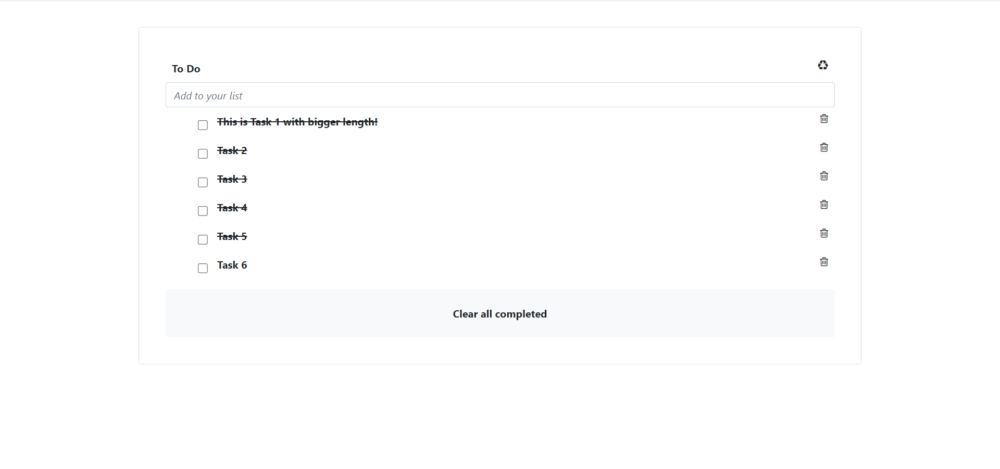
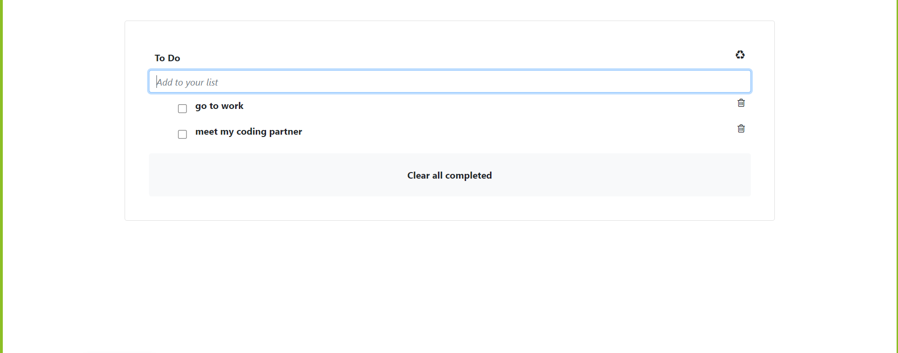
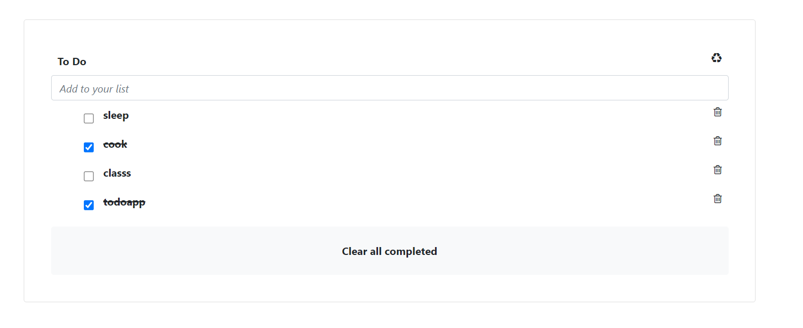

# ToDo-list App


This is a microverse project that allows users to update tasks from a list using javascript modules

Our goal here is to Build a book application with add and remove feature from scratch using JavaScripts... click [here] (https://usorfaitheloho.github.io/ToDo-list-app/dist) to see deployed live version





## Features implemented so far
- Add book feature
- Remove book feature
- Saving current state of booklist to local storage 

## Built With

- HTML5, Javascript
- CSS3
- Linters

To get a local copy up and running follow these simple example steps.

### Prerequisites
- Have a good knowledge on javascript objects
- Have VSCode or other text editor installed. [Link to download VSCode](https://code.visualstudio.com/download)
- Install node package. [Link to download node](https://nodejs.org/en/download/)
- Have git installed.[Link to download git](https://git-scm.com/downloads)
- Create a github repository.
- Node Package Manager (For installing packages like Lighthous, webhint & stylelint used for checking for debugging bad codes before deployment)

# Getting started

### Cloning the project
- git clone https://github.com/usorfaitheloho/ToDo-list-app.git


cd To-Do-list-Application
npm install
npm run start
```
## Getting packages and debuging with Stylelint
```
npm install --save-dev stylelint@13.x stylelint-scss@3.x stylelint-config-standard@21.x stylelint-csstree-validator@1.x
```
##### For validation detection using Stylelint Run
```
npx stylelint "**/*.{css,scss}"
```
##### from parent source directory
## Getting packages and debuging with ESlint
```
npm install npm install --save-dev eslint@7.x eslint-config-airbnb-base@14.x eslint-plugin-import@2.x babel-eslint@10.x
```
##### For validation detection using Stylelint Run
```
npx eslint .
```
##### from parent source directory
## Getting packages and debuging with Webhint
```
npm init -y
npm install --save-dev hint@6.x
```
##### For validation detection using Webhint Run
```
npx hint .
```
## Unit Testing
You can find each unit test cases in the Test folder located in the parent source directory of the project. you can create your own custom unit test and test it by running
```
npx run test
```
This should run all unit test found in the application.test.js from the Test folder.


## Authors

👤 **Faith Eloho usor**

- GitHub: [@githubhandle](https://github.com/usorfaitheloho)


